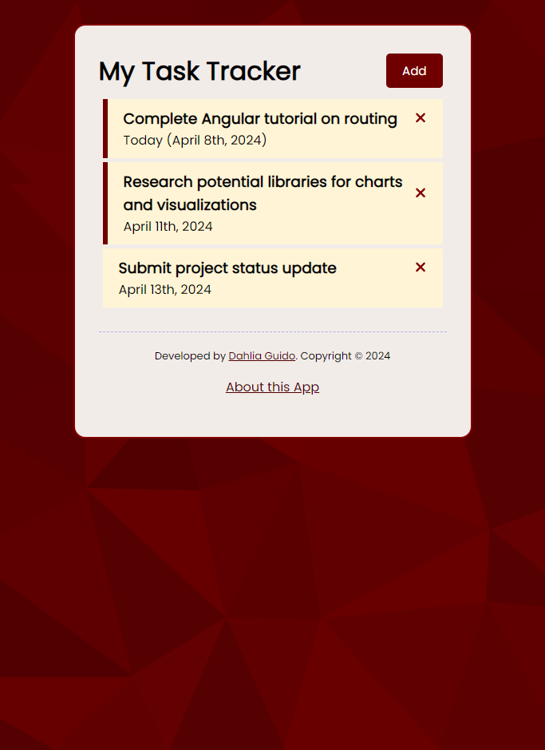
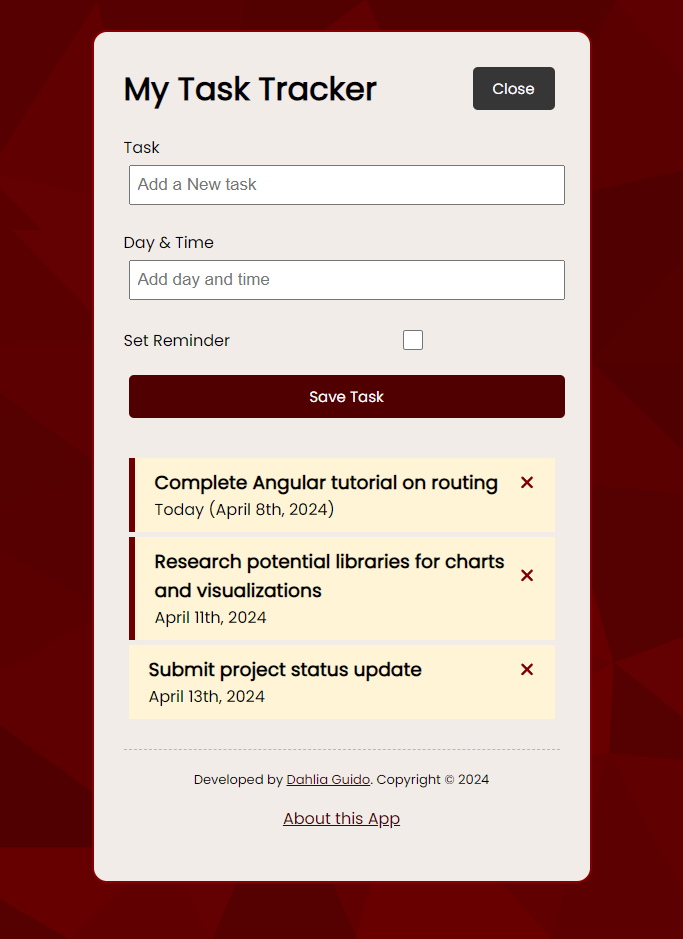
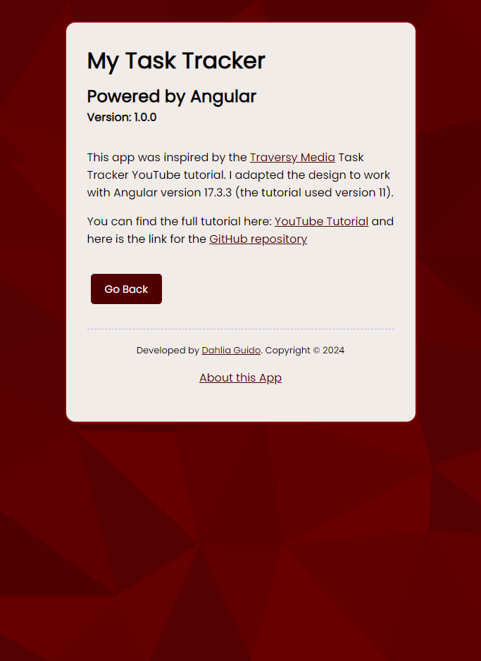

# My Task Tracker 

> This project was generated with [Angular CLI](https://github.com/angular/angular-cli) version 17.3.2.

[](https://opensource.org/licenses/MIT)

A simple task management application built with Angular for the frontend and JSON-server as a mock backend. Inspired by [Traversy Media's Angular Crash Course](#attributions)


 

 

## Table of Contents
  * [Features](#features-✨)
  * [Screenshots](#screenshots)
  * [Getting Started](#getting-started-📖)
  * [Technologies Used](#technologies-used-🛠️)
  * [Project Structure](#project-structure-📁)
  * [Additional Notes](#additional-notes-💡)
  * [Contributing](#contributing)
  * [License](#license)
  * [Questions](#questions)
<br><br>

## Features ✨
- **Add Tasks:** Create new task entries with descriptions and optional reminders.
- **Delete Tasks:** Remove tasks as they are completed.
- **Reminder Toggle:** Mark tasks with reminders and update their status.
- **CRUD Operations:** The app supports basic create, read, update, and delete functionalities.

## Screenshots

<br>
<br>
<br>


## Getting Started 📖

### Prerequisites
- Node.js and `npm` (or yarn) – To install dependencies and run `JSON-server`

### Installation
1. Clone this GitHub repository to your local machine. <br> 
```sh
git clone https://github.com/CypherNyx/task-tracker-app.git
```
2. Open a terminal or command prompt and navigate to the cloned repository's directory.
```
cd task-tracker
```
3. Run the install command in your terminal
```
npm install
``` 

### Running the Development Servers
1. Start JSON-server (in a separate terminal):
```
npm run server
```
This will start the mock backend on port 5000.

2. Run `ng serve` for a dev server. Navigate to `http://localhost:4200/`. The application will automatically reload if you change any of the source files.

## Technologies Used 🛠️

* Frontend:
  * Angular (version 17.3.0)
  * Font Awesome (for icons)
* Backend:
  * JSON-server
* Other:
  * RxJS
  * TypeScript

## Project Structure 📁

* `src/app` - Contains your Angular components, services, etc.
* `db.json` - The data file for your JSON-server.

## Additional Notes 💡

### Code scaffolding

Run `ng generate component component-name` to generate a new component. You can also use `ng generate directive|pipe|service|class|guard|interface|enum|module`.

### Build

Run `ng build` to build the project. The build artifacts will be stored in the `dist/` directory.

### Running unit tests

Run `ng test` to execute the unit tests via [Karma](https://karma-runner.github.io).

### Running end-to-end tests

Run `ng e2e` to execute the end-to-end tests via a platform of your choice. To use this command, you need to first add a package that implements end-to-end testing capabilities.

### Further help

To get more help on the Angular CLI use `ng help` or go check out the [Angular CLI Overview and Command Reference](https://angular.io/cli) page.

<br>
<br>

## Contributing
Pull requests are welcome. Please open an issue first to discuss any proposed changes or additions.
<br>

### Attributions

* **Angular Crash Course**:  [Link to YouTube Tutorial](https://www.youtube.com/watch?v=3dHNOWTI7H8&ab_channel=TraversyMedia) by [Traversy Media](https://www.youtube.com/@TraversyMedia)
* **Background Image** generated using the [Haikei App](https://app.haikei.app/)
* **Libraries:**
  * Angular-fontawesome: [Link](https://github.com/FortAwesome/angular-fontawesome)


## License
[](https://opensource.org/licenses/MIT)
  
  https://opensource.org/licenses/MIT <br> 
  This project is open source and available under the MIT License.

<br>

  ## Questions
  GitHub [CypherNyx](https://github.com/CypherNyx)<br>
  Email: dguido.dev@gmail.com


